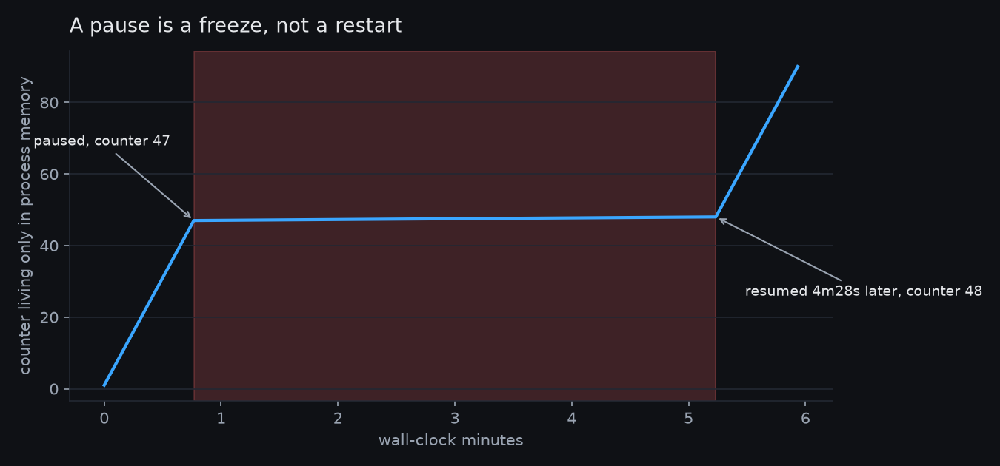
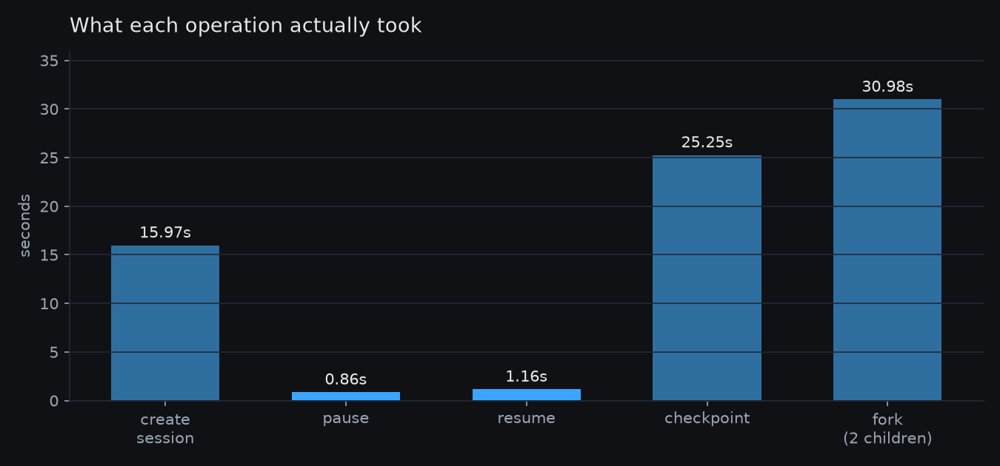
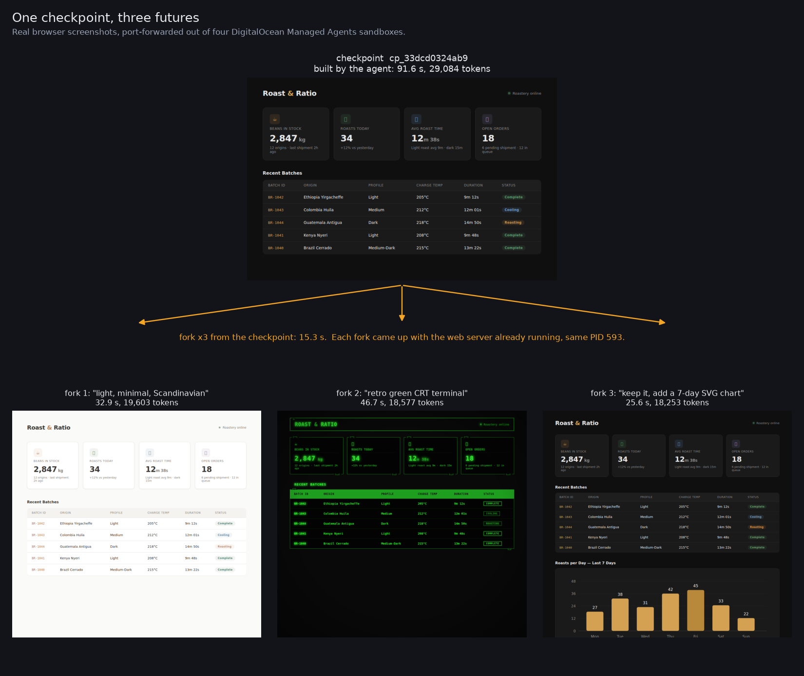
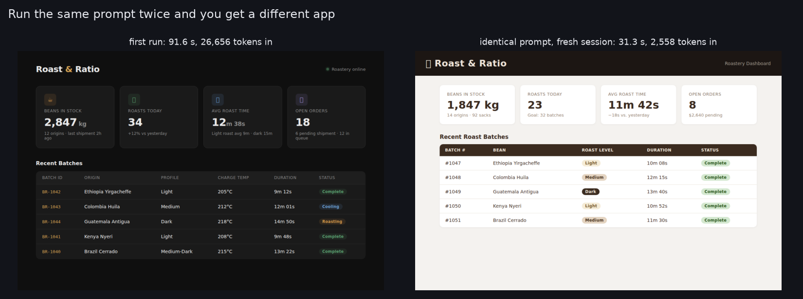
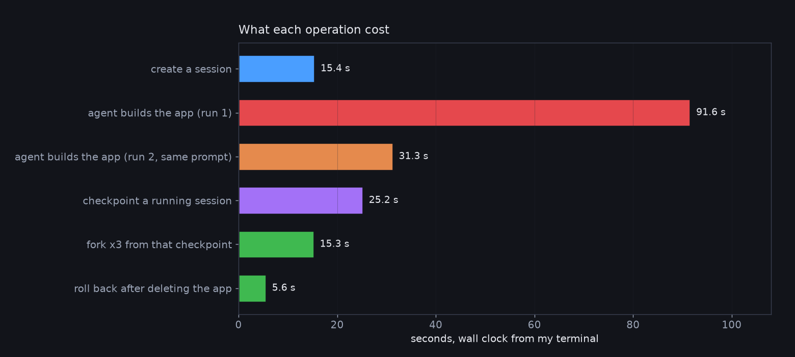

# managed-agents-pause-test

What I actually measured when running a coding agent on DigitalOcean's Managed
Agents (Harness Runtime), in public preview, on 29 September 2026.

The question was narrow: when the docs say a paused session preserves
"processes, memory, and the workspace filesystem", is that literally true?

So I started a process whose counter exists **only in memory**, never read back
from disk, paused the session, waited four and a half minutes, and resumed.



```
47 08:05:42     <- paused here
48 08:10:10     <- resumed here, same PID
```

The counter continued from 47 to 48 with the same PID. The only trace of the
pause is a 4m28s hole in the timestamps.



Forking was the bigger surprise. Two children created from the running parent
both came up with the *same process at the same PID*, then diverged:

| | ticker PID | counter shortly after |
|---|---|---|
| parent | 590 | 244 |
| child 1 | 590 | 231 |
| child 2 | 590 | 228 |

## Files

- `agent.yaml` — the session manifest used for the pause test
- `locked.yaml` — the same thing with an egress allowlist, which flips the
  sandbox to deny-by-default
- `tick.log` — the raw counter log, including the gap

## Reproducing

```bash
doctl harness-runtime create -f agent.yaml
doctl harness-runtime pause <session-id>
doctl harness-runtime resume <session-id>
```

Total cost of everything here, four sessions including two forks: about 7 cents.

MIT licensed.

## Follow-up: checkpoint, fork three ways, roll back

An agent built a small web app inside a session. I checkpointed it, forked it three ways
from that checkpoint, gave each fork a different brief, and screenshotted all three through
`doctl harness-runtime port-forward`. Then I deleted the parent's app, killed its web server,
and rolled it back.



| | |
|---|---|
| agent builds the app | 91.6 s, 29,084 tokens |
| checkpoint the running session | 25.2 s |
| fork x3 from that checkpoint | 15.3 s |
| roll back after deleting the app | 5.6 s |

Every fork came up with the web server **already running, same PID 593**, and after the
rollback the killed server was back at PID 593 too. The restored page was pixel-identical to
the original except for 88 pixels in a CSS-animated status dot.

Checkpoints belong to one session. Rolling a fork back to its parent's checkpoint fails with
`checkpoint not found`, so checkpoint the fork itself if you want to undo inside it.



